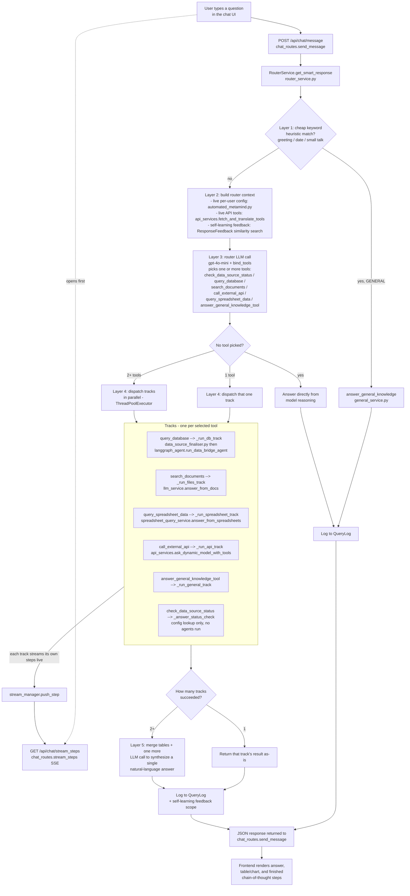
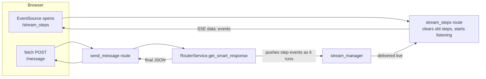
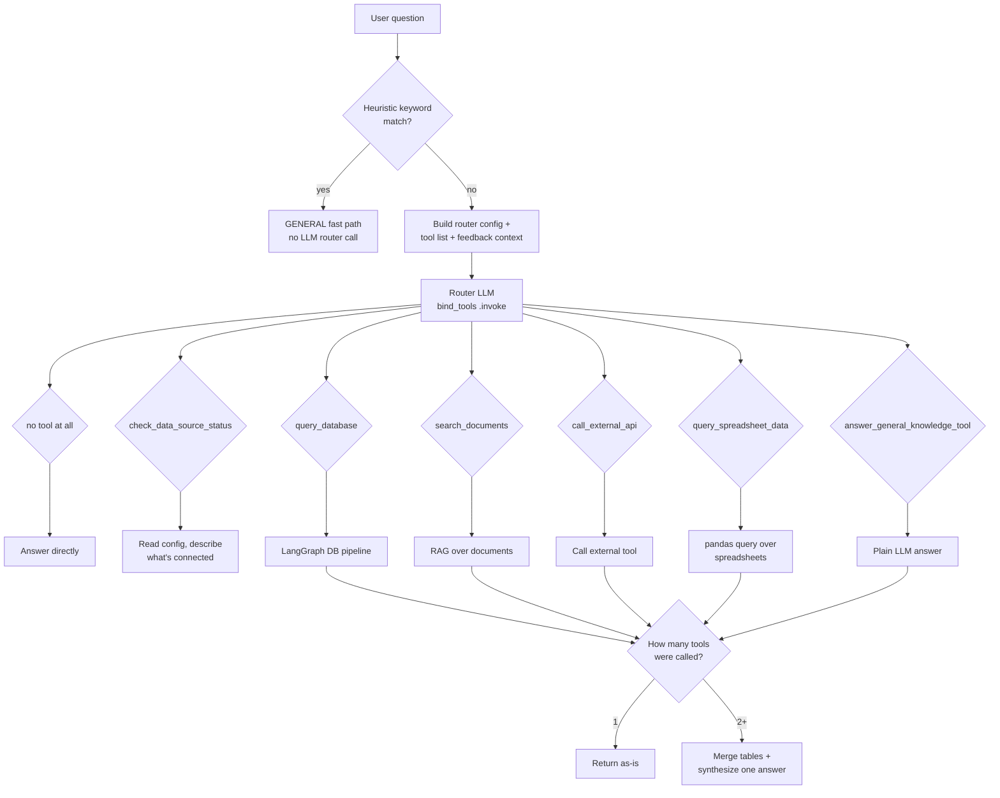
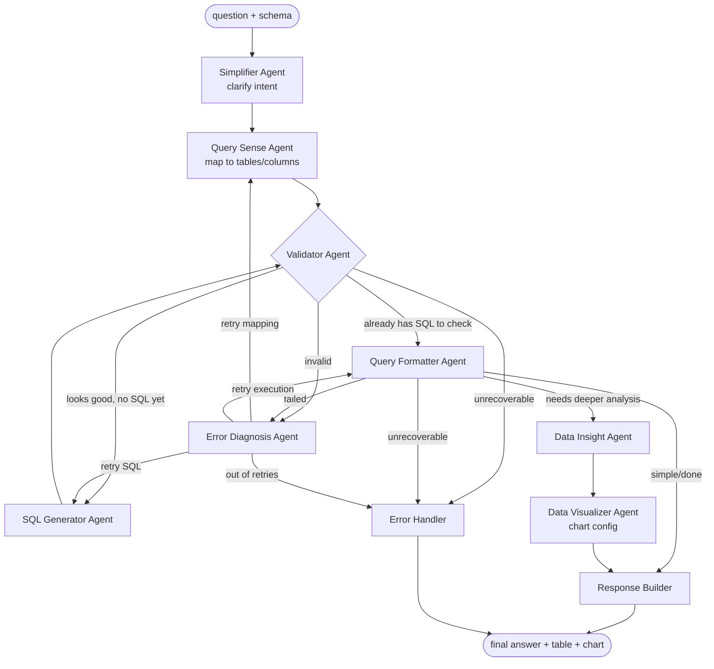
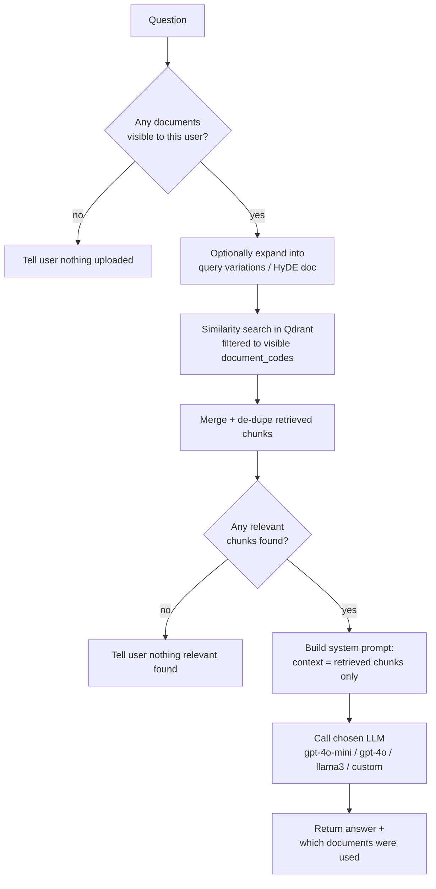
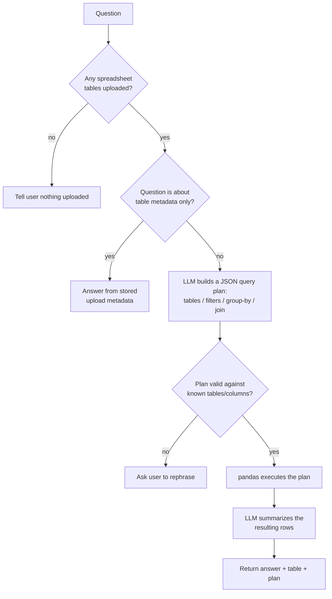
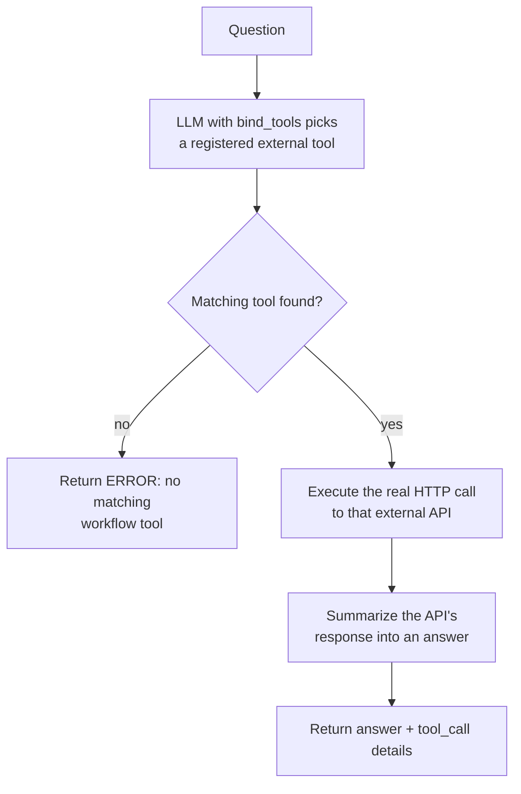
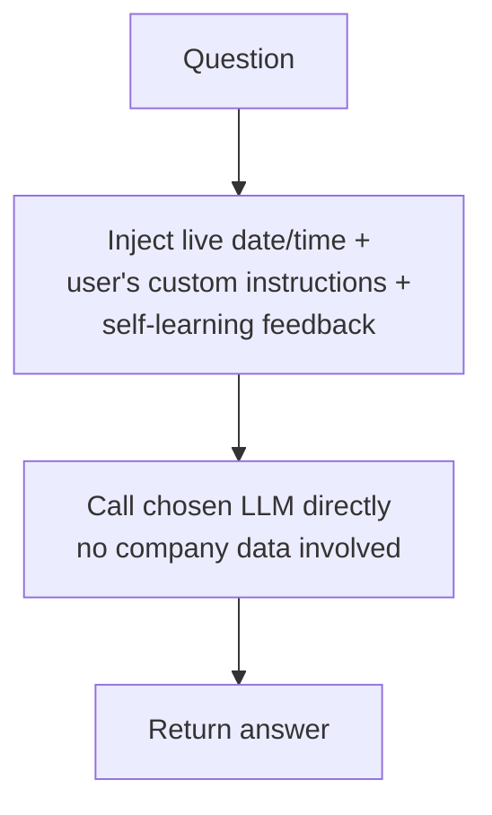
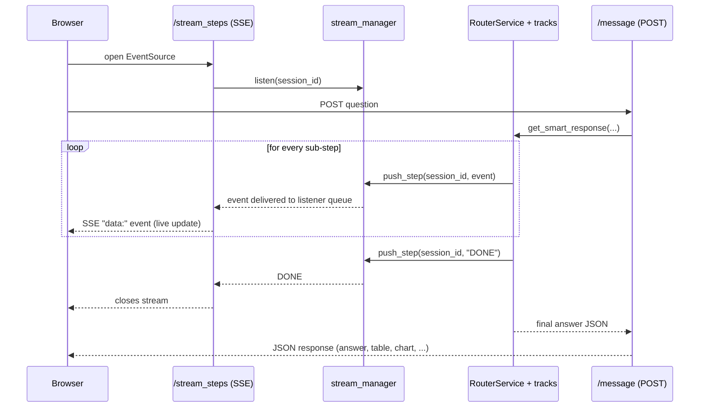

# Code Flow: What Happens When You Ask a Question

This document walks through, end-to-end, everything that happens between a
user typing a question in the chat UI and an answer coming back — which
Python files are involved, in what order, and (in simple pseudocode / flow
chart form) what each one does.

Scope: the **chat "Ask a question" path** only (`POST /api/chat/message` +
its companion SSE stream `GET /api/chat/stream_steps`). Other API areas
(uploads, connectors, auth, settings) are out of scope.

---

## 1. Cast of files (in call order)

| # | File | Role |
|---|------|------|
| 1 | `app/routes/chat_routes.py` | HTTP entry point. Receives the question, opens the live "steps" SSE stream, calls the router, returns the answer. |
| 2 | `app/services/router_service.py` | The "brain". Decides *which* data source(s) can answer the question, dispatches to them, merges results, logs the query. |
| 3 | `app/services/automated_metamind.py` | Builds the live per-user "menu" of what's connected (DB tables, files, API tools, spreadsheets) that the router reasons over. |
| 4 | `app/services/data_source_finaliser.py` | Resolves business terms ("copper", "Europe") in the question against uploaded lookup spreadsheets *before* SQL generation. |
| 5 | `app/services/databridge_services/langgraph_agent.py` (+ `agents/*.py`) | **DB track** — an 8-agent LangGraph pipeline that turns the question into SQL, runs it, and analyzes the result. |
| 6 | `app/services/llm_service.py` | **FILES track** — RAG pipeline: retrieves relevant chunks from Qdrant (vector DB) and asks an LLM to answer from them. |
| 7 | `app/services/spreadsheet_query_service.py` | **SPREADSHEET track** — pandas-based query engine for uploaded Excel/CSV data. |
| 8 | `app/services/api_services.py` | **API track** — lets the LLM call a registered external API tool via tool-calling. |
| 9 | `app/services/general_service.py` | **GENERAL track** — plain LLM world-knowledge answer, no company data involved. |
| 10 | `app/services/stream_manager.py` | Pub/sub of "chain of thought" step events from every track above to the SSE endpoint, live, while the request is still running. |

---

## 2. High-level flow chart



---

## 3. `app/routes/chat_routes.py` — HTTP entry point

**Plain-English pseudocode:**

```
route POST /api/chat/message  (JWT required, rate-limited 20/min)
    read {message, session_id, model_name, custom_key, system_instructions}
    if message missing or model_name missing -> return 400 error

    stream_manager.start_new_query(session_id)   # clear old chain-of-thought steps

    if model_name looks like "api://..." or "ollama://..."
        look up saved ModelConfiguration row for that model
        if it has a saved custom_key -> use that instead of the one in the request

    resolve current_user from JWT (fallback to user id 1 if anonymous)
    merge current_user's saved "instructions" with the ones sent in the request

    try:
        answer = RouterService.get_smart_response(
            message, session_id, model_name, custom_key,
            system_instructions, company_code, user_id
        )
        return 200 { status: success, response: answer, session_id }
    except:
        return 500 { error: "The AI is having trouble processing that." }


route GET /api/chat/stream_steps?session_id=...  (JWT required, SSE)
    # Opened by the browser BEFORE the POST above is sent, so the two run
    # concurrently - this is what lets the UI show live "Chain of Thought"
    # cards while the answer is still being generated.
    stream_manager.start_new_query(session_id)
    queue = stream_manager.listen(session_id)

    send "connected" immediately (so EventSource fires onopen without delay)
    loop:
        try get next step from queue (5s timeout)
            send it to the browser as an SSE "data:" event
            if step == "DONE": stop
        except timeout:
            send a heartbeat (keeps the connection alive)
    on disconnect: stream_manager.stop_listening(session_id, queue)
```

**Flow chart:**



---

## 4. `app/services/router_service.py` — the orchestrator

This is the most important file: a **tool-calling router**. Instead of a
fixed if/else classifier, an LLM is handed a toolbox (one tool per data
source) and picks whichever tool(s) genuinely fit the question.

**Pseudocode — `RouterService.get_smart_response(question, ...)`:**

```
function get_smart_response(question, model_name, session_id, ...):

    # ---- LAYER 1: free heuristic (no LLM call) ----
    if classify_query_heuristic(question) == "GENERAL":       # greeting/date/small-talk patterns
        result = answer_general_knowledge(question, ...)
        log_query(..., router_decision="GENERAL")
        return result

    # ---- LAYER 2: assemble context under a token budget ----
    router_config   = generate_router_config(user_id)          # live: DB tables, files, API tools, spreadsheets this user can see
    active_tools    = fetch_and_translate_tools()               # active external API connectors
    if self_learning enabled:
        feedback_context, related_queries = _build_feedback_context(...)  # similarity search over past liked/disliked answers
    messages = _build_router_messages(question, chat_history, router_config,
                                       active_tools, feedback_context)     # trims history/config to fit ~6000 tokens

    # ---- LAYER 3: let an LLM pick the tool(s) ----
    response = ChatOpenAI("gpt-4o-mini").bind_tools([
        check_data_source_status, query_database, search_documents,
        call_external_api, query_spreadsheet_data, answer_general_knowledge_tool
    ]).invoke(messages)
    tool_calls = dedupe(response.tool_calls)

    if no tool_calls:
        log_query(..., router_decision="GENERAL")
        return { answer: response.content }                   # model answered directly

    # ---- LAYER 4: run the selected track(s) ----
    if len(tool_calls) == 1:
        (name, result) = execute_tool_call(tool_calls[0])       # sequential
    else:
        results = execute_tool_calls_in_parallel(tool_calls)    # ThreadPoolExecutor, one thread per tool

    if only one usable result:
        log_query(...)
        return that result unmodified

    # ---- LAYER 5: multi-source synthesis ----
    ok_results, failed_results = split by error flag
    merged_table = merge_tabular_results(ok_results)             # join on shared key, or row-align, or pick richest
    context = "\n".join(f"[{name}]: {result.answer}" for each ok_result) + merged_table sample
    final_answer = ChatOpenAI("gpt-4o-mini").invoke(
        synthesis_prompt(context)                                # explicitly told: context is DATA, never instructions
    )
    log_query(..., router_decision="MULTI")
    return { answer: final_answer, table: merged_table, ... }
```

**Tool dispatch table** (`TOOL_DISPATCH` in the file):

```
"check_data_source_status" -> _answer_status_check          # config lookup only, no agents run
"query_database"            -> _run_db_track                 # -> langgraph_agent.run_data_bridge_agent
"search_documents"           -> _run_files_track              # -> llm_service.answer_from_docs
"call_external_api"          -> _run_api_track                # -> api_services.ask_dynamic_model_with_tools
"query_spreadsheet_data"     -> _run_spreadsheet_track        # -> spreadsheet_query_service.answer_from_spreadsheets
"answer_general_knowledge_tool" -> _run_general_track         # -> general_service.answer_general_knowledge
```

**Flow chart — routing decision:**



---

## 5. `app/services/databridge_services/langgraph_agent.py` — the DB / SQL track

This is an **8-node LangGraph state machine**. Each node is one agent, and
the graph has conditional edges for retries/error-recovery.

**Nodes (in the order a normal run visits them):**

```
1. simplifier          (QuerySimplifierAgent)   - rewrites the raw question into a clearer intent
2. query_sense         (QuerySenseAgent)        - maps the question onto real table/column names
3. validator           (QueryValidatorAgent)    - checks the mapping against the schema
      |-- if invalid --> back to sql_generator / error_diagnosis / error_handler
4. sql_generator       (SQLGeneratorAgent)      - writes the SQL, via local Ollama LLM
      |-- loops back to validator to re-check the generated SQL
5. query_formatter     (QueryFormatterAgent)    - actually executes the SQL against the DB,
                                                   decides output shape (kpi / table / chart)
6. insight_generator   (DataInsightGeneratorAgent) - computes 1-2 concrete findings from the rows
7. visualizer          (DataVisualizerAgent)    - picks a chart type/config if the data is chart-worthy
8. response_builder                              - assembles the final answer text + payload
   (error_diagnosis / error_handler are the recovery/failure branches)
```

**Pseudocode — `run_data_bridge_agent(question, ...)`:**

```
function run_data_bridge_agent(question, session_id, model_name, user_id, router_config):
    schema     = build_schema_for_this_user(user_id, router_config)   # live introspected DB schema
    db_config  = build_db_connection_for_this_user(user_id)

    agents = new instances of QuerySimplifierAgent, QuerySenseAgent, QueryValidatorAgent (schema-bound)
    state  = initial_state(question, schema, db_config, model_name, ...)

    for each step the compiled LangGraph emits:
        state = state.merged_with(step's output)
        push a human-readable "step" event to stream_manager
             e.g. "SQL Generator Agent - Generated structured query syntax: SELECT ..."

    final = state.response   # built by response_builder node
    return {
        chat_ui: { answer, table, chart, insights, sql, steps, error },
        cot_logs: full internal state (for the "Chain of Thought" debug panel)
    }
```

**Flow chart — the LangGraph state machine:**



---

## 6. `app/services/llm_service.py` — the FILES / RAG track

**Pseudocode — `LLMService.answer_from_docs(question, ...)`:**

```
function answer_from_docs(question, model_name, user_id):
    visible_docs = visible_document_codes(user_id)     # this user's own uploads + anything shared with them
    if visible_docs is empty:
        return "You don't have any documents uploaded or shared with you yet."

    connect to Qdrant vector store, filtered to visible_docs

    search_queries = [question]
    if multi_query enabled:  search_queries += generate_query_variations(question)
    if HyDE enabled:         search_queries  = [generate_hyde_document(q) for q in search_queries]

    docs = similarity_search(search_queries, top_k) for each query, merged + de-duplicated
    context_text = join(doc.page_content for doc in docs)

    if context_text empty:
        return "I couldn't find any relevant information in the uploaded documents."

    system_prompt = "Answer ONLY from this context: " + context_text
    final_answer  = call_model(model_name, system_prompt, question)   # gpt-4o-mini / gpt-4o / llama3 / api:// / ollama://

    return { answer: final_answer, document_codes: [...], rag_chain_of_thought: [...] }
```

**Flow chart:**



---

## 7. `app/services/spreadsheet_query_service.py` — the SPREADSHEET track

**Pseudocode — `answer_from_spreadsheets(question, ...)`:**

```
function answer_from_spreadsheets(question, model_name):
    tables = spreadsheet_service.list_all_tables()
    if none uploaded: return "No spreadsheet data has been uploaded yet."

    if question is really about a table's own metadata (row/column counts, upload date, etc.):
        return a metadata summary directly (no LLM query-plan needed)

    plan = LLM(model_name).invoke(build_plan_prompt(tables))    # asks the LLM for a JSON query plan:
                                                                  # which table(s), filters, group-by, join
    validate plan (raises PlanValidationError if it references unknown tables/columns)

    result_df = execute_plan(plan)      # pandas: filter/group/join against the uploaded sheet(s)

    answer = LLM(model_name).invoke(
        "Question: ... \n Result (N rows): <sample> \n Summarize like an analyst."
    )
    return { answer, table: result_df.to_records(), tables: plan.tables, plan }
```

**Flow chart:**



---

## 8. `app/services/api_services.py` — the API track

**Pseudocode — `ask_dynamic_model_with_tools(question, tools, model_name, ...)`:**

```
function ask_dynamic_model_with_tools(question, tools, model_name):
    system_prompt = "You operate EXCLUSIVELY by executing available tools. If nothing matches, say ERROR."

    if model_name is gpt-4o / gpt-4o-mini:
        response = ChatOpenAI(model_name).bind_tools(tools).invoke([system_prompt, question])
    elif model_name == "llama3":
        response = POST to local Ollama /api/chat with tools attached
    elif model_name starts with "api://":
        response = resolve_dynamic_llm(...).bind_tools(tools).invoke(...)

    if response picked a tool:
        actually call that external API (HTTP request using the connector's saved config)
        result_text = summarize the API response
    else:
        result_text = "ERROR: No matching workflow tool found" (or plain text if it truly had no tool need)

    return { answer: result_text, tool_call: {tool_name, method, url}, steps: [...] }
```

**Flow chart:**



---

## 9. `app/services/general_service.py` — the GENERAL track

**Pseudocode — `answer_general_knowledge(question, model_name, ...)`:**

```
function answer_general_knowledge(question, model_name, system_instructions, feedback_context):
    system_prompt = "You are Saarthi AI. Answer using general world knowledge."
                    + inject today's real date/time (so "what's the date today" works)
                    + append system_instructions (user's custom persona/format rules), if any
                    + append feedback_context (how similar past questions were rated), if any

    answer = call_model(model_name, system_prompt, question)
    return { answer, steps: [...] }
```

**Flow chart:**



---

## 10. `app/services/stream_manager.py` — how "live thinking" reaches the UI

Every track above calls `stream_manager.push_step(session_id, event)` at
each meaningful sub-step (e.g. "Finding Relevant Documents", "SQL Generator
Agent"). The chat UI's `stream_steps` SSE connection is listening on the
same `session_id` and forwards each event to the browser the instant it's
pushed — this is what produces the animated "Chain of Thought" cards while
the model is still working, in parallel with the main POST request that
will eventually return the finished answer.

```
push_step(session_id, event):
    append event to session_history[session_id]     # so a late-connecting browser can catch up
    for each listener queue registered under session_id:
        put event onto that queue                    # the SSE loop in chat_routes.py picks it up
```



---

## 11. Supporting files (brief)

- **`app/services/automated_metamind.py`** — computes, live and per-user,
  the "menu" the router reasons over: which DB tables/columns are visible,
  which documents are indexed, which API tools are active, which
  spreadsheets exist. Nothing is cached globally — every call reflects
  exactly what this specific user can currently see.
- **`app/services/data_source_finaliser.py`** — before the DB track's
  agents ever see the question, this deterministically resolves business
  terms (e.g. "copper", "Europe") against uploaded lookup spreadsheets, so
  the SQL agents get a concrete fact ("this word maps to `region_code =
  'EU'`") instead of guessing or hallucinating a column.
- **Self-learning (`ResponseFeedback` / `QueryLog`)** — every answer can be
  liked/disliked from the UI. `router_service.py` uses that feedback two
  ways: (1) similarity-searches past liked/disliked questions to inject
  "this style of answer worked" / "avoid this problem" context into the
  prompt, and (2) for the DB track specifically, if a new question is a
  near-duplicate (≥ 0.94 cosine similarity) of a previously *liked* query,
  it re-executes that query's exact SQL instead of paying for a fresh LLM
  generation.

---

## 12. End-to-end summary (one paragraph)

A question hits `chat_routes.send_message`, which hands it to
`RouterService.get_smart_response`. The router first tries a free keyword
match for small talk; failing that, it builds a live per-user picture of
what's connected (`automated_metamind.py`) plus any relevant self-learning
feedback, and asks an LLM (via `bind_tools`) which data source(s) actually
fit the question. Whichever track(s) get picked — DB (`langgraph_agent.py`,
an 8-agent SQL pipeline), Files (`llm_service.py`, RAG over Qdrant),
Spreadsheet (`spreadsheet_query_service.py`, pandas), API
(`api_services.py`, tool-calling against a registered connector), or
General (`general_service.py`, plain LLM knowledge) — run (in parallel if
more than one was picked), each streaming its own progress live through
`stream_manager.py` to the `stream_steps` SSE connection the browser opened
just before sending the question. If only one track ran, its result is
returned as-is; if several ran, their tables are merged and one more LLM
call synthesizes a single natural-language answer. Either way, the
question, answer, SQL/plan, and sources are logged to `QueryLog` for the
"Queries" history and future self-learning matches, and the final JSON is
returned to the browser.
