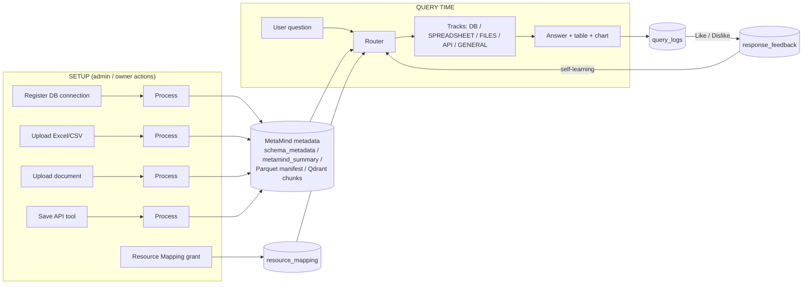
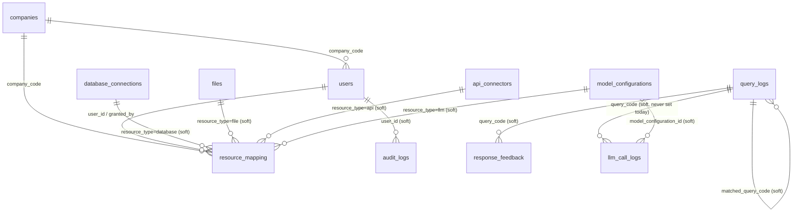
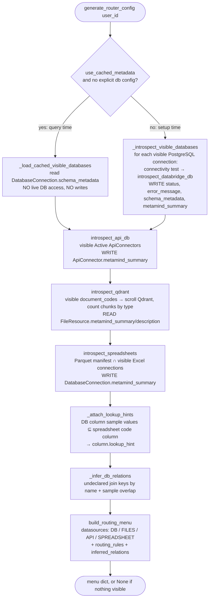
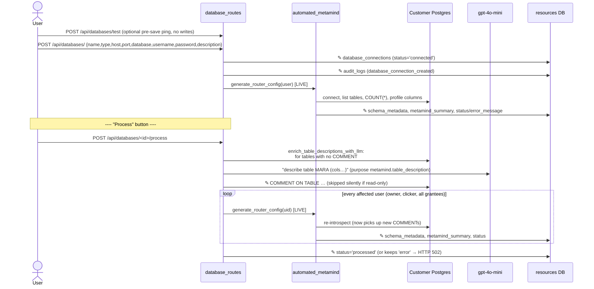
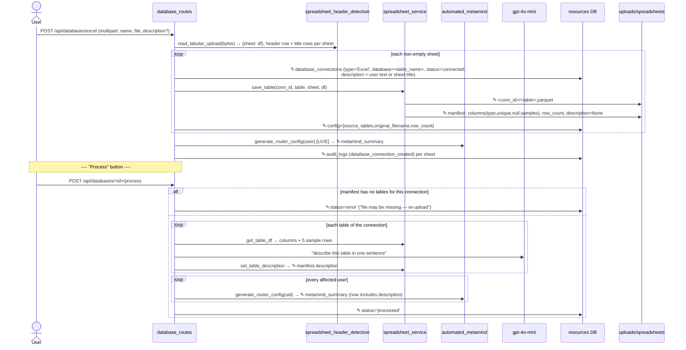
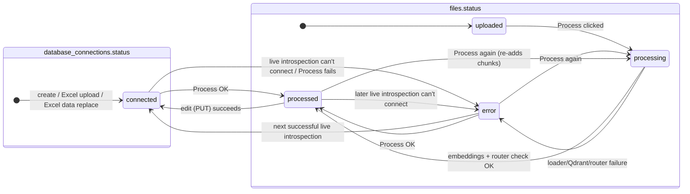
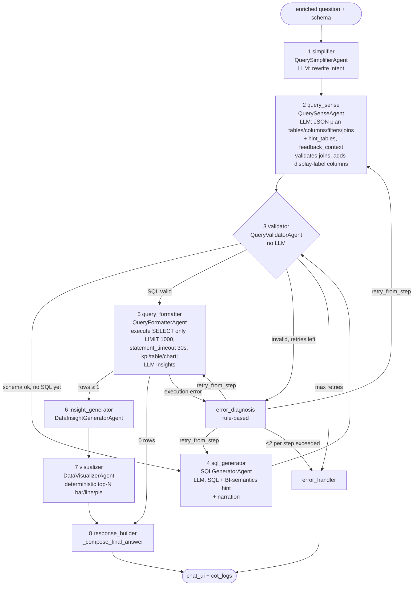
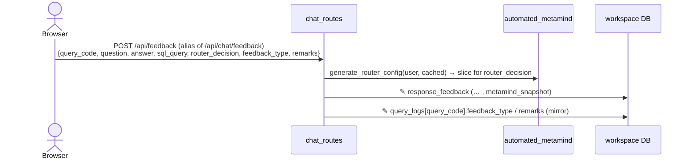

# Saarthi 2.0 — Detailed Design Document

> **Scope.** This covers the whole Saarthi codebase as it stands on this branch. It focuses on:
>
> 1. **Runtime flows.** Which modules run, and in what order, for each user action. That means the chat question, plus every "setup" action such as **Save**, **Process**, **Upload**, **Like/Dislike** and **Grant access**.
> 2. **Data ownership.** Which database tables (and non-database stores) each flow **creates, reads, updates or deletes**, and how a later flow uses what an earlier flow wrote.
>
> `docs/CODE_FLOW_QUESTION_ANSWERING.md` is a lighter walkthrough of the chat path only. This document is a superset of it and adds the data-model view.

---

## Table of contents

1. [System overview](#1-system-overview)
2. [Runtime components & deployment](#2-runtime-components--deployment)
3. [Code layout (module map)](#3-code-layout-module-map)
4. [Persistence model](#4-persistence-model)
5. [Tenancy & visibility rule ("own + granted")](#5-tenancy--visibility-rule-own--granted)
6. [MetaMind — the per-user router config](#6-metamind--the-per-user-router-config)
7. [Setup flows (what populates the tables)](#7-setup-flows-what-populates-the-tables)
8. [Query flow — what happens when a question is asked](#8-query-flow--what-happens-when-a-question-is-asked)
9. [Track internals](#9-track-internals)
10. [Self-learning (feedback & query reuse)](#10-self-learning-feedback--query-reuse)
11. [Observability: Query log, LLM call log, Audit log](#11-observability-query-log-llm-call-log-audit-log)
12. [Model selection & LLM backends](#12-model-selection--llm-backends)
13. [Data warehouse builder (side feature)](#13-data-warehouse-builder-side-feature)
14. [Table × flow CRUD matrix](#14-table--flow-crud-matrix)
15. [Configuration reference](#15-configuration-reference)
16. [Observed gaps & risks in the current code](#16-observed-gaps--risks-in-the-current-code)

---

## 1. System overview

Saarthi is a multi-tenant "ask your company data" assistant. A user types a natural-language question. An LLM **router** then decides which of the user's connected data sources can answer it, dispatches the question to one or more **tracks**, merges the results, and returns an answer with an optional table and chart.

| Track | Data it answers from | Engine |
|---|---|---|
| **DB** | External PostgreSQL databases the user registered (e.g. an SAP replica) | 8-agent LangGraph pipeline → SQL |
| **SPREADSHEET** | Uploaded Excel/CSV files, stored as Parquet (never loaded into Postgres) | LLM writes a JSON query plan → pandas executes it |
| **FILES** | Uploaded documents (PDF/DOCX/MD/TXT …) | RAG over Qdrant |
| **API** | Registered external REST endpoints | LLM tool-calling → HTTP request |
| **GENERAL** | No company data (world knowledge, greetings, dates) | Plain LLM call |

A data source is only answerable after it goes through **setup**: register/upload → **Process** (introspect, summarise, index) → optionally **share** with colleagues through Resource Mapping. Setup writes the metadata that the router reads at question time. That metadata is called *MetaMind*.



---

## 2. Runtime components & deployment

`docker-compose.yml` runs these services:

| Service | Image | Used for |
|---|---|---|
| `web` | Flask app (`run.py` → `app.create_app`) | All HTTP routes, HTML templates, every service in the same process |
| `db` | `postgres:15` | The app's **own** 3 logical databases (core / resources / workspace) |
| `redis` | `redis:7-alpine` | Flask-Limiter rate-limit storage (`RATELIMIT_STORAGE_URI = REDIS_URL`) |
| `qdrant` | `qdrant/qdrant` | Vector store for document chunks (collection `saarthi_unstructured`) |
| `ollama` (×2) | `ollama/ollama` | Local LLMs (`llama3` etc.) for the DB agents and for "OSS" model choices |

Volumes: `postgres_data`, `redis_data`, `ollama_data`, **`uploads_data`** (uploaded files, Parquet spreadsheets, manifest), `nltk_data`, `hf_cache` (HuggingFace embedding model).

External, user-supplied systems: the **customer PostgreSQL databases** registered as connections, and the **REST APIs** registered as API connectors. Saarthi never writes business data into its own databases. It reads from these external systems at question time.

### App bootstrap (`app/__init__.py:create_app`)

```
create_app(config_name)                                  # run.py reads FLASK_ENV
 ├─ load config/config.py (derives 3 DB URLs from DATABASE_URL)
 ├─ db_bootstrap.bootstrap_databases(SQLALCHEMY_BINDS)   # CREATE DATABASE saarthi_core_db / _resources_db / _workspace_db if missing
 ├─ init SQLAlchemy, Migrate, JWT, Limiter(Redis), Swagger
 ├─ register 23 blueprints (pages + /api/*)
 ├─ import app.models  (registers all ORM classes)
 └─ app_context:
      configure_mappers(); db.create_all()               # creates missing tables in each bind
      db_bootstrap.sync_missing_columns(db)              # additive ALTER TABLE ADD COLUMN for new model fields
      db_bootstrap.drop_removed_tables(db, ['router_configs'])   # legacy cached-router table is dropped
```

The schema is defined by the ORM models; there is no hand-written DDL. Alembic is wired up (`migrations/`), but in practice `create_all` + `sync_missing_columns` keeps the schema in step.

---

## 3. Code layout (module map)

```
run.py                       entry point (Flask dev server / gunicorn target)
config/config.py             env-driven config; 3 SQLAlchemy binds
app/__init__.py              app factory + schema bootstrap
app/models/                  ORM models (one file per table)
app/routes/                  Flask blueprints (HTTP layer)
   chat_routes.py              /api/chat/*  — message, SSE steps, sessions, feedback
   database_routes.py          /api/databases/* — DB & Excel connections, Process
   upload_routes.py            /api/upload/*, /api/files/* — document upload/view/delete
   datasource_routes.py        /api/datasources/* — Knowledge Base list, description, Details, document Process
   api_routes.py               /api_connectors/* — API tool save/test/delete/Process
   resource_mapping_routes.py  /api/resource-mapping/* — admin sharing grants (+ LLM budgets)
   auth_routes.py              /api/auth/* — register, verify, login, approve/reject
   platform_routes.py          /api/platform/companies — superadmin company provisioning
   model_config_routes.py      /api/model-config/* — configured LLMs, global selection
   user_model_pipeline_routes  /api/user/model-pipeline, /api/models/* — per-step model choices
   settings_routes.py          /api/settings/* — rag_config.yaml, query instructions
   query_log_routes.py         /api/query-logs/ — Queries page
   llm_call_log_routes.py      /api/llm-calls/ — LLM Calls page
   export_routes.py            /api/export/results/<id> — full-result Excel download
   warehouse_routes.py         /api/warehouse/* — ETL script generator
   bi_semantics_routes.py      /api/bi-semantics/* — default measure per table
   api_v1_routes.py            /api/v1/chat — programmatic chat endpoint
   page_routes.py              HTML pages
   (analytics/history/user/workspace/export-* stubs)
app/services/
   router_service.py           ★ query orchestrator (RouterService.get_smart_response)
   automated_metamind.py       ★ MetaMind: introspection + per-user router config
   databridge_services/        ★ DB track: LangGraph graph + 8 agents
   spreadsheet_service.py        Parquet storage + JSON manifest
   spreadsheet_query_service.py  SPREADSHEET track
   spreadsheet_header_detection  finds the real header row in uploaded sheets
   llm_service.py                FILES track (RAG) + document ingestion (embeddings)
   api_services.py               API track (tool-calling + HTTP execution)
   general_service.py            GENERAL track
   data_source_finaliser.py      resolves business terms via lookup spreadsheets (pre-DB track)
   bi_semantics_service.py       default measure/aggregation hints for SQL generation
   model_selection_service.py    which model runs each pipeline step
   model_config_access_service   LLM grants + daily budgets
   llm_call_logger.py            tracked_invoke → llm_call_logs
   stream_manager.py             in-memory pub/sub for live "Chain of Thought" steps
   result_export_service.py      saves full result sets for Excel download
   audit_service.py              log_event → audit_logs
   warehouse_generator.py        warehouse ETL generation/execution
   rag_config.yaml / .py         RAG + self-learning + LLM-logging settings
app/utils/                   crypto (Fernet), query/llm call codes, redaction, network_guard (SSRF), decorators
app/templates/               Jinja HTML + vanilla JS front-end (index.html = chat)
```

---

## 4. Persistence model

### 4.1 Three logical application databases

`config/config.py` derives three database URLs from one `DATABASE_URL`. Each model chooses a database with `__bind_key__`.



"Soft" means the link is a plain integer or string column with no database foreign key, because the two tables live in different databases. The `resource_mapping`, `companies` and `users` links are real foreign keys inside `core`.

#### `core` database — identity, tenancy, access, audit

| Table (model) | Key columns | Purpose |
|---|---|---|
| `companies` (`Company`) | `company_code` PK, `company_name`, `initial_admin_email` | Tenant boundary. Pre-provisioned by a superadmin. |
| `users` (`User`) | `id`, `email` (unique), `password_hash`, `company_code` FK (NULL = individual account), `role` admin/user, `status` active/pending/rejected, `email_verified`, `verification_token(_expires)`, **`query_instructions`**, `last_login` | Auth + tenancy. `query_instructions` = standing per-user rules injected into every query. |
| `resource_mapping` (`ResourceMapping`) | `company_code` FK, `resource_type` (`database`/`file`/`api`/`llm`), `resource_id`, `user_id` FK, `granted_by_user_id` FK, `daily_budget`, `budget_currency`; unique (`resource_type`,`resource_id`,`user_id`) | Explicit admin-granted sharing. **Nothing is shared without a row here.** |
| `audit_logs` (`AuditLog`) | `company_code`, `user_id`, `action`, `resource_type`, `resource_id`, `details` JSON, `created_at` | Security/tenant event trail. |

#### `resources` database — data source registry & MetaMind metadata

| Table (model) | Key columns | Purpose |
|---|---|---|
| `database_connections` (`DatabaseConnection`) | `name`, `type` (`PostgreSQL`/`MySQL`/…/**`Excel`**), `host/port/database/username/password`, `config` JSON, **`status`** (`connected`/`processed`/`error`/…), `error_message`, `description` (user), **`metamind_summary`** (AI), **`schema_metadata`** JSON (cached introspection), `company_code`, `created_by_user_id`, `last_tested` | Every structured data source. Excel/CSV uploads are rows here too (`type='Excel'`, **one row per sheet**), but their data lives in Parquet. |
| `files` (`FileResource`) | `document_code` (unique, e.g. `DOC-POL-20260101-101500`), `file_name`, `file_type`, `file_size`, `file_path`, `description` (user), **`status`** (`uploaded`→`processing`→`processed`/`error`), `error_message`, **`metamind_summary`** (AI topic summary), `company_code`, `created_by_user_id` | Unstructured documents. Chunks live in Qdrant tagged with `metadata.document_code`. |
| `api_connectors` (`ApiConnector`) | `integration_name` (unique), `base_url`, `endpoint`, `method`, `auth_type`, `api_token` (Fernet-encrypted), `api_description` (required), `status` (`Active`), **`metamind_summary`** (redacted router-visible text), `company_code`, `created_by_user_id` | Registered REST tools for the API track. |

#### `workspace` database — chat, models, learning, logs

| Table (model) | Key columns | Purpose |
|---|---|---|
| `chat_sessions` (`ChatSession`) | `session_id` (unique, client-generated), `title`, `chat_history` (rendered HTML of the conversation), `user_id`, `company_code` | Sidebar chat history (one row per conversation). |
| `query_logs` (`QueryLog`) | **`query_code`** (`QUERY00001`…), `user_id`, `company_code`, `question`, `answer`, **`router_decision`** (`DB`/`FILES`/`API`/`SPREADSHEET`/`GENERAL`/`MULTI`), `strategy`, `sources` JSON, **`main_query`** (SQL, plan JSON, or `METHOD URL`), **`execution_type`** (`fresh`/`reused`), `matched_query_code`, `match_score`, **`feedback_type`**, `remarks`, `related_queries` JSON | One row per answered question. It is the source for the Queries page **and** for self-learning reuse. |
| `response_feedback` (`ResponseFeedback`) | `user_id`, `company_code`, `query_code`, `question`, `answer`, `sql_query`, `router_decision`, **`feedback_type`** like/dislike, `remarks`, `metamind_snapshot` JSON | Self-learning signal. Liked rows feed the router's feedback context. |
| `model_configurations` (`ModelConfiguration`) | `name`, `model` (e.g. `gpt-4o-mini`, `api://claude-…`, `ollama://llama3`), `provider`, `settings` JSON (`custom_key`, `base_url`, `company_code`, `is_global_default`, `step_overrides` …), `user_id`, `company_code` | "Configured Models" under AI & Models. |
| `user_model_pipelines` (`UserModelPipeline`) | `user_id`, `main_model`, `model_type_preference` (oss/api), **`step_models`** JSON (`{query_sense: …, sql_generator: …}`) | Per-user choice of model for each DB-pipeline step. |
| `bi_semantics_configs` (`BiSemanticsConfig`) | `user_id`, `table_name`, `entity_label`, `measure_column`, `aggregation`; unique (`user_id`,`table_name`) | Per-user default measure (e.g. sales orders → `SUM(net_value)`), layered over built-in defaults. |
| `llm_call_logs` (`LLMCallLog`) | **`call_code`** (`LLMC00000001`), `user_id`, `company_code`, `session_id`, `query_code`, **`purpose`** (`router.decision`, `sql_generator.generate_sql`, `rag.answer`…), `provider`, `model`, `model_configuration_id`, token counts, **`cost`**, `duration_ms`, `status`, `prompt_preview`, `response_preview` | Every LLM call made anywhere in the app (when `llm_logging.enabled`). |

### 4.2 Non-database stores (equally important)

| Store | Location | Written by | Read by |
|---|---|---|---|
| Uploaded documents | `./uploads/<file>` | `POST /api/upload/unstructured` | Process (embedding), view/download |
| **Spreadsheet Parquet files** | `./uploads/spreadsheets/<connection_id>/<table>.parquet` | `POST /api/databases/excel`, `PUT /<id>/excel` | SPREADSHEET track, lookup hints, finaliser, preview/download |
| **Spreadsheet manifest** | `./uploads/spreadsheets/spreadsheet_metadata.json` | `spreadsheet_service.save_table`, `set_table_description` (**Process**), `delete_connection_tables` | `introspect_spreadsheets`, SPREADSHEET track |
| **Qdrant collection** `saarthi_unstructured` | Qdrant service | Document **Process** (`llm_service.process_to_embeddings`) | FILES track, `introspect_qdrant` |
| **External DB table comments** | `COMMENT ON TABLE` in the customer's Postgres | PostgreSQL **Process** (`enrich_table_descriptions_with_llm`) | `introspect_databridge_db` (table descriptions) |
| Result exports | `<instance>/result_exports/<uuid>.json` (7-day TTL) | `chat_routes.send_message` → `save_result_export` | `GET /api/export/results/<id>` (Excel download) |
| `rag_config.yaml` | `app/services/rag_config.yaml` | Settings page (`POST /api/settings/rag-config`) | RAG, self-learning switch, LLM-logging pricing |
| Live step stream | In-process memory (`stream_manager`) | Every track, while a query runs | `GET /api/chat/stream_steps` (SSE) |
| Process logs | `./logs/process_<id>_<ts>.log` | `run-agentic-process` | Operators only |
| Browser `localStorage` | `saarthi_chat_history`, JWT | Front-end | Front-end |

---

## 5. Tenancy & visibility rule ("own + granted")

Every resource-listing and MetaMind function applies the same rule:

```
visible(user, resource_type) =
      rows WHERE created_by_user_id = user.id
  ∪   rows WHERE id IN (SELECT resource_id FROM resource_mapping
                        WHERE resource_type = :type AND user_id = user.id)
```

* Sharing a `company_code` **does not** make a resource visible. Only an admin's `resource_mapping` grant does.
* Implemented in `automated_metamind._visible_resource_ids()` (returns the granted IDs; callers OR them with "own"), `visible_document_codes()`, `_visible_postgresql_connections()`, `datasource_routes.get_visible_datasources()` and the list endpoints in each route file.
* **Modify/delete** rights are wider: the creator, **or** an admin of the resource's company (`_can_modify_connection`, file/API delete checks).
* Chat sessions and query-log visibility are per user. The query log is per company when the user has a `company_code` (`query_log_routes`).

---

## 6. MetaMind — the per-user router config

"MetaMind" is the description of *what this user can query*. It is **not stored as one document**. `automated_metamind.generate_router_config(user_id, sap_db_config=None, use_cached_metadata=False)` recomputes it every time, from the tables listed above. (A legacy `router_configs` table used to cache it and is now dropped at boot.)

### 6.1 What `generate_router_config` does (in order)



### 6.2 What `introspect_databridge_db(db_config)` captures per table

For each `public` base table, skipping Saarthi's own tables and any `_`-prefixed padding tables:

* `description`: `obj_description()` (the table COMMENT), or the fallback `"Table storing X records."`
* `row_count`: `COUNT(*)`
* `constraints`: primary key, foreign keys, unique columns
* per column: `data_type`, `nullable`, and, when `row_count ≤ 100,000`, also `unique_values`, `null_count` and up to 5 `sample_values`

This is the shape stored in **`DatabaseConnection.schema_metadata`**. The connection's free-text `description` is prefixed onto each table description at read time, so editing the description takes effect without re-introspecting.

### 6.3 Two modes and who calls which

| Mode | Cost | Side effects | Callers |
|---|---|---|---|
| **Live** (`use_cached_metadata=False`, default) | Connects to every visible PG connection: `COUNT(*)`, then per-column profiling | Updates `database_connections.status/error_message/schema_metadata/metamind_summary`, `api_connectors.metamind_summary`, Excel `metamind_summary` | DB create/update/**Process**, Excel upload/edit/**Process**, document **Process**, API save/**Process**, Knowledge Base **Details** popup (`/metadata`) |
| **Cached** (`use_cached_metadata=True`) | Reads stored JSON only (Qdrant/API/spreadsheet parts are still read live) | None for DB. API/spreadsheet `metamind_summary` writes are no-ops when the text is unchanged | **Every chat question** (`router_service._load_router_config`), DB-track schema fallback, feedback snapshot |

> **Key consequence:** a PostgreSQL connection contributes **no tables** to routing until it has been introspected live at least once. Creating it or clicking **Process** does that. Schema changes in the customer database are invisible to Saarthi until the next live introspection.

---

## 7. Setup flows (what populates the tables)

Every flow below lists the **module call sequence** and the **table/store writes**. In the sequence diagrams, ✎ means "writes".

### 7.1 Company provisioning, signup, login

```mermaid
sequenceDiagram
    actor SA as Superadmin
    actor U as New user
    actor AD as Company admin
    participant P as platform_routes
    participant A as auth_routes
    participant E as email_service
    participant DB as core DB

    SA->>P: POST /api/platform/companies {code,name,initial_admin_email}
    P->>DB: ✎ companies
    U->>A: POST /api/auth/register {name,email,password,company_code?}
    alt no company_code
        A->>DB: ✎ users (role=admin,status=active)  — individual account
    else company exists, email == initial_admin_email
        A->>DB: ✎ users (role=admin,status=active)
    else company exists
        A->>DB: ✎ users (role=user,status=pending)
    end
    A->>E: send_verification_email(token)
    A->>DB: ✎ audit_logs (user_registered)
    U->>A: GET /api/auth/verify-email?token
    A->>DB: ✎ users.email_verified=true
    U->>A: POST /api/auth/login
    A->>DB: read users; ✎ users.last_login; ✎ audit_logs (login_success / login_blocked)
    A-->>U: JWT (1h)
    AD->>A: POST /api/auth/approve/<id>  (or /reject)
    A->>DB: ✎ users.status=active|rejected; ✎ audit_logs (employee_approved|rejected)
```

Login is refused when `email_verified` is false or `status` is `pending`/`rejected`. The JWT identity is `user.id`. `get_current_user()` resolves it on every protected route.

### 7.2 PostgreSQL connection — Save → Process

UI: **Database Connections** page (`database_connections.html`).



**What Process changes for later queries:**

* The cached `schema_metadata` (tables, columns, samples, constraints) is now fresh. **This is the schema the router and the SQL agents see.**
* Table descriptions improve, because LLM-written COMMENTs replace the generic "Table storing X records." The router uses these descriptions to pick tables.
* `metamind_summary` is refreshed. It appears in the Knowledge Base list and Details popup.

**Edit** (`PUT /api/databases/<id>`) re-runs the live config for owner, editor and grantees. **Delete** removes the `resource_mapping` rows and the connection row. Nothing else needs cleaning up, because routing is computed live and the connection simply disappears from the next query.

**Advanced: `POST /api/databases/run-agentic-process/<id>`** runs two scripts as subprocesses: `databridge_services/db.py` (seeds an SAP-style demo dataset into the target DB) and `metamind.py` (*the file no longer exists*, see §16). It then introspects, stores `schema_metadata`, regenerates config for everyone affected, and writes `audit_logs (agentic_process_run)`. The UI no longer calls it.

> **Note on non-PostgreSQL types (MySQL, Oracle, …).** Rows can be saved, but `_visible_postgresql_connections` only introspects `type == 'PostgreSQL'`. These connections never contribute schema, so the DB track cannot query them.

### 7.3 Excel / CSV upload → Process

UI: **Spreadsheets** page (`spreadsheets.html`) or the Database Connections page (Excel type).



**What Process changes for later queries:** the manifest `description` fills `SPREADSHEET.tables[t].description` in the routing menu. That description is the main signal the router uses to choose `query_spreadsheet_data`, and it also feeds the **lookup-hint** cross-reference (§9.1) that lets DB questions use spreadsheet code tables.

**Edit** (`PUT /api/databases/<id>/excel`) renames, changes the description, and/or replaces the data with a single-sheet file. On a data replace it overwrites the Parquet file and manifest entry, **sets `metamind_summary=NULL` and `status='connected'`** (so Process must be run again), then regenerates config. **Delete** removes the mapping rows, the connection row, the Parquet files and the manifest entries. **Preview/Download** read the Parquet data.

### 7.4 Document upload → Process (FILES)

UI: **Unstructured Data** page (`unstructured_data.html`).

```mermaid
sequenceDiagram
    actor U as User
    participant UR as upload_routes
    participant DR as datasource_routes
    participant L as LLMService
    participant Q as Qdrant
    participant LLM as gpt-4o-mini
    participant MM as automated_metamind
    participant RES as resources DB

    U->>UR: POST /api/upload/unstructured (files[], file_type, description?)
    UR->>UR: extension allow-list, secure_filename, libmagic sniff (reject executables)
    UR->>RES: ✎ files (document_code=DOC-XXX-yyyymmdd-hhmmss, status='uploaded')
    UR->>RES: ✎ audit_logs (file_uploaded)

    Note over U,DR: ---- "Process" button ----
    U->>DR: POST /api/datasources/unstructured/<document_code>/process
    DR->>RES: ✎ files.status='processing'
    DR->>L: process_to_embeddings(path, document_code)
    L->>L: loader by ext (PyMuPDF / Docx2txt / Markdown / RTF / Text)
    L->>LLM: _summarize_document_topics (purpose rag.document_summary)
    L->>L: optional table/image extraction (rag_config gates), image captioning
    L->>L: RecursiveCharacterTextSplitter(800/80); tag metadata.document_code, chunk_type
    L->>Q: QdrantVectorStore.from_documents (MiniLM-L6-v2 embeddings)
    DR->>RES: ✎ files.metamind_summary = content summary (or "N chunk(s) indexed")
    DR->>MM: generate_router_config(user) — sanity check Qdrant visibility
    DR->>RES: ✎ files.status='processed' (or 'error' + error_message)
    DR->>RES: ✎ audit_logs (file_processed)
```

**What Process changes for later queries:** the document's chunks become retrievable, and `metamind_summary` appears in `FILES.vector_store_info.documents[].description`. The router reads this to decide on `search_documents` and to pick `document_codes`.

**Delete** (`DELETE /api/files/<code>` or `/api/datasources/unstructured/<code>`): purge the Qdrant points by `document_code` → remove the disk file → delete the `resource_mapping` rows → delete the `files` row → write `audit_logs`.

### 7.5 API connector Save → Process (API)

UI: **REST APIs** page (`api_connectors/rest_apis.html`).

```
POST /api_connectors/test_connection   → network_guard.is_safe_url (SSRF block) → live HTTP ping, no writes
POST /api_connectors/save_tool         → is_safe_url → upsert api_connectors (token Fernet-encrypted;
                                         empty token on edit keeps the old one) → audit_logs
                                         → generate_router_config(user) [LIVE] → ✎ api_connectors.metamind_summary
POST /api_connectors/tools/<name>/process → generate_router_config(uid) for owner, clicker, grantees
                                         (refreshes metamind_summary; no other state)
DELETE /api_connectors/delete_tool/<name> → resource_mapping rows + api_connectors row → audit_logs
```

At query time the API track reads the connectors through `api_services.fetch_and_translate_tools()`. That function turns each **Active** connector into an OpenAI function-tool schema (name = sanitised `integration_name`, description = redacted `api_description`).

### 7.6 Knowledge Base page — description edit & Details

* `GET /api/datasources/` → `get_visible_datasources(user)`: a merged list of DB, Excel, file and API resources showing `status`, `description`, `metamind_summary`, creator, and owner/shared.
* `PUT /api/datasources/<type>/<id>/description` → writes `description` (or `api_description`). No regeneration is needed, because the next query reads it live (DB descriptions are prefixed at read time).
* `GET /api/datasources/<type>/<id>/metadata` (**Details** popup) → `generate_router_config(user)` **in live mode**, sliced down to the selected resource, returning both summary and full metadata. Note that this re-scans the user's PG connections.

### 7.7 Resource Mapping (sharing) & LLM budgets

UI: **Resource Mapping** / **LLM Mapping** pages. Admin-only (`@admin_required`), and limited to users and resources of the admin's own company.

```
POST   /api/resource-mapping          single grant  → ✎ resource_mapping → audit_logs(resource_mapping_grant)
POST   /api/resource-mapping/bulk     users × resources → ✎ resource_mapping (skips duplicates) → audit_logs
PATCH  /api/resource-mapping/<id>/budget   ✎ daily_budget / budget_currency (llm grants only)
DELETE /api/resource-mapping/<id>     → ✎ delete → audit_logs(resource_mapping_revoke)
```

No regeneration happens. The grantee's next question resolves visibility live. Because `schema_metadata` is stored per connection, a grantee immediately sees the cached schema of a shared DB connection that has already been processed.

### 7.8 Model configuration & pipeline selection

* `model_config_routes` → CRUD on `model_configurations`. It seeds default open-source models per company and stores `custom_key`/`base_url`/`is_global_default`/`step_overrides` in `settings`.
* `user_model_pipeline_routes` → `POST /api/user/model-pipeline` upserts `user_model_pipelines` (`main_model`, `step_models`). `/auto-fill` and `/models/recommendations` produce presets from `model_registry_service`.
* `settings_routes` → `POST /api/settings/query-instructions` writes `users.query_instructions`. `POST /api/settings/rag-config` rewrites `rag_config.yaml` (RAG knobs, `self_learning.enabled`, LLM pricing).
* `bi_semantics_routes` → upsert/delete `bi_semantics_configs`.

### 7.9 Status lifecycles



> Re-processing a document calls `from_documents` again **without deleting the old points first**, so its chunks are duplicated in Qdrant (see §16).

---

## 8. Query flow — what happens when a question is asked

### 8.1 Front-end handshake

`index.html` does the following, in order:

1. Opens an `EventSource` on **`GET /api/chat/stream_steps?session_id=…&token=<JWT>`**. This route accepts the JWT from the query string only.
2. Once it receives `onopen` (the server immediately sends `{connected:true}`), it sends **`POST /api/chat/message`** with `{message, session_id, model_name, custom_key?, system_instructions?}`.
3. It renders live step cards from the SSE events until it sees `step == "DONE"`.
4. It renders the POST JSON (answer, table, chart, insights, steps, `query_code`, `export`).
5. It saves the conversation HTML through `POST /api/chat/sessions` → `chat_sessions` (and to `localStorage`).
6. Thumbs up/down → `POST /api/feedback` → §10.

### 8.2 End-to-end sequence

```mermaid
sequenceDiagram
    autonumber
    actor B as Browser
    participant SSE as chat_routes.stream_steps
    participant SM as stream_manager
    participant CR as chat_routes.send_message
    participant RS as RouterService.get_smart_response
    participant MM as automated_metamind
    participant LLM as Router LLM (gpt-4o-mini)
    participant TR as Track(s)
    participant WS as workspace DB

    B->>SSE: EventSource open
    SSE->>SM: start_new_query(sid); listen(sid)
    SSE-->>B: data:{connected:true}
    B->>CR: POST /api/chat/message
    CR->>SM: start_new_query(sid)
    CR->>WS: read model_configurations (api:// or ollama:// → custom_key/base_url)
    CR->>CR: user = JWT user (fallback id 1); instructions = users.query_instructions + per-message
    CR->>RS: get_smart_response(q, sid, model, key, instructions, company_code, user_id)

    RS->>RS: L1 classify_query_heuristic (general_knowledge_config.json)
    alt greeting/date/small talk
        RS->>TR: general_service.answer_general_knowledge
        RS->>WS: ✎ query_logs (GENERAL)
    else
        RS->>WS: L1.5 _find_reusable_query: liked DB/SPREADSHEET rows in query_logs, cosine ≥ 0.94
        alt near-duplicate liked query
            RS->>TR: replay stored SQL / plan (no router LLM)
            RS->>WS: ✎ query_logs (execution_type='reused', matched_query_code, match_score)
        else
            RS->>MM: L2 generate_router_config(user, cached)
            RS->>WS: read api_connectors (fetch_and_translate_tools)
            RS->>WS: read response_feedback (liked, cosine ≥ threshold) → feedback_context
            RS->>RS: _build_router_messages (≈6000-token budget, trimmed config, static hints)
            RS->>LLM: L3 bind_tools(6 tools).invoke  (✎ llm_call_logs router.decision)
            LLM-->>RS: tool_calls (deduped)
            RS->>SM: begin_tracks(n)
            par L4 one thread per tool call
                RS->>TR: _run_db_track / _run_spreadsheet_track / _run_files_track / _run_api_track / _run_general_track / _answer_status_check
                TR->>SM: push_step(...) … "DONE"
            end
            opt ≥2 successful tracks
                RS->>RS: L5 _merge_tabular_results
                RS->>LLM: synthesis prompt (router.multi_source_synthesis)
            end
            RS->>WS: ✎ query_logs (fresh)
        end
    end
    SM-->>SSE: events (live)
    SSE-->>B: data:{step…}  …  DONE
    RS-->>CR: result dict
    CR->>CR: save_result_export(table) → instance/result_exports/<uuid>.json
    CR-->>B: {status, response:{answer,sql,table,chart,insights,format,steps,router_decision,query_code,export}}
```

### 8.3 Layer-by-layer reference (`router_service.py`)

| Layer | Function(s) | Reads | Writes | LLM calls |
|---|---|---|---|---|
| **L1 heuristic** | `classify_query_heuristic` | `general_knowledge_config.json` | `query_logs` (on hit) | 1 (general answer) |
| **L1.5 reuse** | `_find_reusable_query` → `REUSE_DISPATCH[DB\|SPREADSHEET]` | `query_logs` (`feedback_type='like'`, `router_decision ∈ {DB,SPREADSHEET}`, `main_query` not null, scoped to company or user, newest 200); HF MiniLM embeddings | `query_logs` (reused) | 0 for routing/SQL. DB reuse still runs the insight generator in the formatter |
| **L2 context** | `_load_router_config` → `generate_router_config(cached)`; `fetch_and_translate_tools`; `_build_feedback_context`; `_build_router_messages` | `database_connections.schema_metadata/description`, `resource_mapping`, `files`, Qdrant scroll, manifest, Parquet (lookup hints), `api_connectors`, `response_feedback` | – | 0 |
| **L3 routing** | `ChatOpenAI("gpt-4o-mini").bind_tools(_ALL_TOOLS)` via `tracked_invoke` | – | `llm_call_logs` | 1 |
| **L4 dispatch** | `_execute_tool_call(s)` / `TOOL_DISPATCH`, using a `ThreadPoolExecutor` with its own Flask app context when >1 | see §9 | see §9 | per track |
| **L5 synthesis** | `_merge_tabular_results`, `_decide_output_format`, `_generate_chart_for_merged_table`, `_build_multi_strategy` | `answer_guidelines.md` | `query_logs` (MULTI), `llm_call_logs` | 1 (+1 chart if needed) |

**Router tools** (the LLM chooses one or more, and each call carries a rewritten sub-question):

| Tool | Args | Dispatches to | `router_decision` logged |
|---|---|---|---|
| `check_data_source_status` | `track` | `_answer_status_check` (reads the config only) | *not logged* |
| `query_database` | `question`, `tables[]` | `_run_db_track` | `DB` |
| `query_spreadsheet_data` | `question`, `tables[]` | `_run_spreadsheet_track` | `GENERAL` ⚠ when it is the only tool (see §16); part of `MULTI` otherwise |
| `search_documents` | `question`, `document_codes[]` | `_run_files_track` | `FILES` |
| `call_external_api` | `question`, `tool_name` | `_run_api_track` | `API` |
| `answer_general_knowledge_tool` | `question` | `_run_general_track` | `GENERAL` |
| *(no tool)* | – | the router's own text | `GENERAL` |

**Outcomes:** 0 tools → direct answer. 1 tool → that track's result returned **unchanged**. ≥2 tools → merged tables + synthesised prose. A failed track is excluded from synthesis and named in a trailing "Note: I couldn't get data from …".

### 8.4 Response contract (`response` object)

```json
{
  "answer": "…", "sql": "SELECT …" , "table": [ {…} ], "chart": {"bar":{…},"line":{…},"pie":{…},"recommended":"bar"},
  "insights": ["…"], "format": "text|kpi|table|chart", "steps": ["Title - description", …],
  "chain_of_thought": [...], "router_decision": "DB|FILES|API|SPREADSHEET|GENERAL|MULTI",
  "execution_type": "fresh|reused", "query_code": "QUERY00042",
  "strategy": "…", "sources": ["orders<Database>", …], "main_query": "…",
  "export": {"export_id": "…", "row_count": N, …}
}
```

---

## 9. Track internals

### 9.1 DB track — `_run_db_track` → LangGraph

**Pre-step: Data Source Finaliser** (`data_source_finaliser.finalize_data_source_strategy`). For every DB column carrying a `lookup_hint` (added by MetaMind when the column's sample values are all codes in a small spreadsheet column), it tries to resolve candidate terms from the question ("copper", "Europe") against that lookup table's label columns (reading the **Parquet** data). Matches are prepended to the question as a "KNOWN CODE TRANSLATIONS" block, e.g. `mara.material_group: "copper" -> 'RM03'`.

**`run_data_bridge_agent(...)`** (`databridge_services/langgraph_agent.py`):

1. `schema = _build_schema_for_user(user_id, router_config)` → `to_sql_agent_schema(DB.tables, inferred_relations)`. This reuses the router config already computed in L2, so **the schema is the cached `schema_metadata`**.
2. `db_config = resolve_query_execution_config(user_id)` → the **first** visible PostgreSQL connection with its password decrypted. If there is none, it falls back to the env `DATABRIDGE_DB_*` / app DB.
3. Builds request-scoped `QuerySimplifierAgent`, `QuerySenseAgent` and `QueryValidatorAgent` with that schema. `SQLGenerator`, `QueryFormatter`, `DataInsightGenerator`, `DataVisualizer` and `ErrorDiagnosis` are module singletons.
4. Streams `langgraph_app.stream(initial_state)`. After each node it pushes a human-readable step card, and at the end pushes `"DONE"`.



| Node | Reads (DB/stores) | LLM `purpose` |
|---|---|---|
| model choice for every node | `user_model_pipelines`, `model_configurations` via `get_model_for_step` | – |
| simplifier | schema | `query_simplifier.simplify` |
| query_sense | schema, `hint_tables`, feedback | `query_sense.plan` |
| validator | schema (column/alias checks) | – |
| sql_generator | **`bi_semantics_configs`** + built-in defaults (`build_measure_guidance`) | `sql_generator.generate_sql`, `sql_generator.narration` |
| query_formatter | **customer Postgres** (read-only SELECT) | `data_insight.generate` |
| insight_generator | result rows | `data_insight.generate` |
| visualizer | result rows; top-N from `query_instructions` | – |

The track returns `main_query = SQL`, which `query_logs.main_query` stores. That stored SQL is what enables later **reuse** (§10).

### 9.2 SPREADSHEET track — `spreadsheet_query_service.answer_from_spreadsheets`

```
available_tables = spreadsheet_service.list_all_tables()          # whole manifest (see §16)
narrow to hint_tables if given
if question is about a table's metadata (rows/columns/upload date) → answer from manifest, no LLM plan
plan  = LLM(purpose spreadsheet.plan): JSON {tables, filters, group_by, aggregations, join, sort, limit}
plan  = _validate_plan(plan, available_tables)                    # unknown table/column → PlanValidationError
df    = _execute_plan(plan)                                       # pandas over Parquet files
answer= LLM(purpose spreadsheet.answer): analyst-style summary of df sample
return {answer, table: df records, tables, plan}
```

`_run_spreadsheet_track` stores `main_query = json.dumps(plan)`. A liked spreadsheet answer can then be replayed by `_run_reused_spreadsheet_query` (it re-runs `_execute_plan` and returns the old answer text verbatim).

### 9.3 FILES track — `llm_service.answer_from_docs`

```
doc_codes = visible_document_codes(user)                       # files own + granted
if none → "You don't have any documents…"
narrow to router's document_codes hint if all are visible
Qdrant filter: metadata.document_code ∈ doc_codes
LLM intent-analysis line (rag.intent_analysis) — shown as a step card
queries = [q] (+ multi_query variations, + HyDE doc — off by default)
similarity_search top_k=3 per query → merge/dedupe
LLM answer strictly from context (rag.answer) — gpt-4o-mini / gpt-4o / llama3 / api:// / ollama://
return {answer, document_codes, rag_chain_of_thought}
```

The track maps `document_codes` back to `files.file_name` for `sources` and `strategy`. Nothing re-runnable is stored in `main_query`.

### 9.4 API track — `api_services.ask_dynamic_model_with_tools`

```
tools = fetch_and_translate_tools()           # Active api_connectors → function schemas
LLM.bind_tools(tools) (forces hint tool_name when supported)   # OpenAI / Ollama /api/chat / api://
if a tool is chosen:
    connector = api_connectors by integration_name
    headers/params from auth_type + decrypt(api_token)  (Bearer, or X-API-Key header + api_key param)
    network_guard → HTTP request → response text
    LLM summarises response
return {answer, tool_call:{tool_name, method, url}, steps}
```

`query_logs.main_query = "METHOD URL"`. The API track is never reused.

### 9.5 GENERAL track & status check

* `general_service.answer_general_knowledge`: a system prompt with today's date/time, the user's instructions and feedback context → the chosen model. Logged as `GENERAL`.
* `_answer_status_check`: reads the routing menu only and describes which tracks have data (e.g. "2 database tables, 3 documents…"). No agents run, and nothing is written to `query_logs`.

### 9.6 Multi-source merge (`_merge_tabular_results`)

For each successful track, in order of preference: join tables on a shared key column whose values actually overlap → otherwise row-align equal-length tables → otherwise pick the richest table. When a same-named key never matches, it emits a `merge_notes` "Data alignment note" so the synthesis LLM does not substitute one source's field for another. The output format is decided by row and column counts. If the format is `chart` and no track supplied one, a chart is generated from the merged table.

---

## 10. Self-learning (feedback & query reuse)

Enabled by `rag_config.yaml → self_learning.enabled: true`.

### 10.1 Writing feedback



* The Settings → Self-Learning page edits feedback afterwards. `PUT /api/chat/feedback/<query_code>` upserts the `response_feedback` row and mirrors it to `query_logs`. `DELETE` clears both.
* Scope: feedback is **company-wide** when the user has a `company_code`, otherwise per user.

### 10.2 Reading feedback at query time

| Mechanism | Source table & filter | Threshold | Effect |
|---|---|---|---|
| **Reuse** (L1.5) | `query_logs` with `feedback_type='like'`, `router_decision ∈ {DB, SPREADSHEET}`, `main_query` not null | `max(0.94, threshold from instructions)` cosine on MiniLM embeddings | Skips the router LLM and SQL/plan generation entirely. Re-executes the stored SQL/plan live. Logged as `execution_type='reused'`, `matched_query_code`, `match_score` |
| **Feedback context** (L2) | `response_feedback` with `feedback_type='like'` (newest 200) | default **0.80**, overridable via Query Instructions such as "Query match threshold 90%" (`instruction_settings.match_threshold_from_instructions`) | Adds "a similar question was LIKED before" lines to the router prompt and to each track's prompts. The matches are stored in `query_logs.related_queries` |

Disliked rows are stored but **never** matched. This is deliberate, to avoid injecting unrelated "avoid this" remarks into other questions.

---

## 11. Observability: Query log, LLM call log, Audit log

| Log | Written by | Granularity | UI |
|---|---|---|---|
| `query_logs` | `router_service._log_query` (every path except status checks and crashes) | 1 row per answered question | **Queries** page `/query_logs` → `GET /api/query-logs/?source=&feedback=&user_id=` (company-wide for company users) |
| `llm_call_logs` | `llm_call_logger.tracked_invoke` (LangChain) / `track_ollama_call` / `record_ollama_call` (raw Ollama) | 1 row per LLM call, with tokens, cost from `rag_config.llm_logging.pricing`, duration, prompt/response previews | **LLM Calls** page `/llm_calls` → `GET /api/llm-calls/`, `/summary` (grouped by `purpose`) |
| `audit_logs` | `audit_service.log_event` | Security/tenant events: register, login(_blocked), approve/reject, resource created/updated/deleted/processed, mapping grant/revoke, agentic run | Audit Logs page |

Common `purpose` values: `router.decision`, `router.multi_source_synthesis`, `query_simplifier.simplify`, `query_sense.plan`, `sql_generator.generate_sql`, `sql_generator.narration`, `data_insight.generate`, `spreadsheet.plan`, `spreadsheet.answer`, `rag.intent_analysis`, `rag.answer`, `rag.hyde`, `rag.multi_query`, `rag.document_summary`, `rag.image_caption`, `metamind.table_description`.

---

## 12. Model selection & LLM backends

* **Router, synthesis, and the MetaMind/Process summaries are always `gpt-4o-mini`** (OpenAI key from `custom_key` or `OPENAI_API_KEY`), whatever model the user picked.
* **Track models** follow the chat dropdown `model_name`:
  * `gpt-4o`, `gpt-4o-mini` → LangChain `ChatOpenAI`
  * `llama3` / `ollama://<model>` → raw HTTP to `http://ollama:11434/api/generate` (DB agents) or `/api/chat` (API track)
  * `api://<model>` → OpenAI-compatible endpoint, where `custom_key`/`base_url` come from the matching `model_configurations.settings`
* **Per-step override for the DB pipeline** (`model_selection_service.get_model_for_step`):
  1. the chat-bar model, if it differs from the user's saved `main_model` (explicit per-request override)
  2. `user_model_pipelines.step_models[step]`
  3. `user_model_pipelines.main_model`
  4. `step_overrides[step]` on the global default `model_configurations` row
  5. the global default model, or the requested model
* **Budgets:** `resource_mapping.daily_budget` for `llm` grants, checked by `model_config_access_service.get_budget_status`. Spend is summed from `llm_call_logs.cost` by `model_configuration_id` (see §16 on why it currently stays 0).

---

## 13. Data warehouse builder (side feature)

`/build_warehouse` and `/warehouse/mapping` pages + `warehouse_routes.py` + `warehouse_generator.py`:

* **Sources:** DB-track tables (via MetaMind) and SPREADSHEET tables (Parquet).
* **Target:** a `database_connections` row with `config.role == "warehouse_target"`.
* **Mapping state** is stored inside that target row's `config` JSON: `warehouse_table_groups` (1 source = 1:1 copy, several = INNER/LEFT join) and `warehouse_mapping[target_table]` (rename/retype/exclude/transform per column).
* `POST /api/warehouse/generate` emits a standalone Python ETL script. `POST /api/warehouse/run` executes it in-process. Run history is written to a **`warehouse_sync_log`** table inside the **target** database. Health checks and a data-model view are also available.

---

## 14. Table × flow CRUD matrix

C = create, R = read, U = update, D = delete. "Manifest" and "Qdrant" are the non-database stores.

| Flow ↓ / Table → | companies | users | resource_mapping | audit_logs | database_connections | files | api_connectors | Manifest/Parquet | Qdrant | chat_sessions | query_logs | response_feedback | model_configurations | user_model_pipelines | bi_semantics_configs | llm_call_logs |
|---|---|---|---|---|---|---|---|---|---|---|---|---|---|---|---|---|
| Provision company | C | | | | | | | | | | | | | | | |
| Register / verify / login / approve | R | C U | | C | | | | | | | | | | | | |
| DB connection save/edit | | R | R | C | C U (schema_metadata, summary, status) | | | | | | | | | | | |
| **DB Process** | | R | R | | U (status, schema_metadata, summary) + COMMENT ON TABLE on external DB | | | | | | | | | | | C |
| Excel upload / edit | | R | R | C | C U | | | C U | | | | | | | | |
| **Excel Process** | | R | R | | U (status, summary) | | | U (description) | | | | | | | | – ¹ |
| Document upload | | R | | C | | C | | | | | | | | | | |
| **Document Process** | | R | R | C | | U (status, summary) | | | C | | | | | | | C |
| API save / **Process** | | R | R | C | | | C U (summary) | | | | | | | | | |
| Delete DB/Excel/doc/API | | R | D | C | D | D | D | D | D | | | | | | | |
| Resource mapping grant/revoke/budget | | R | C U D | C | R | R | R | | | | | | R | | | |
| Description edit / Details | | R | R | | U / R(+live introspect) | U / R | U / R | R | R | | | | | | | |
| **Ask question (fresh)** | | R | R | | R (schema_metadata, desc) | R | R | R | R | | **C** | R | R | R | R | **C** |
| **Ask question (reused)** | | R | | | R | | | R | | | **C** + R | | R | | | C (insights) |
| Save chat session | | R | | | | | | | | C U | | | | | | |
| Like / Dislike / edit feedback | | R | R | | R | R | R | R | R | | U | C U D | | | | |
| Model config / pipeline / BI semantics | | R | | | | | | | | | | | C U D | C U | C U D | |
| Queries / LLM Calls pages | | R | | | | | | | | | R | | | | | R |

¹ The Excel Process summariser calls `llm.invoke` directly (not `tracked_invoke`), so it leaves no `llm_call_logs` row.

---

## 15. Configuration reference

| Setting | Where | Effect |
|---|---|---|
| `DATABASE_URL` | env | Host/credentials for the 3 app databases (`saarthi_core_db`, `saarthi_resources_db`, `saarthi_workspace_db`) |
| `SECRET_KEY`, `JWT_SECRET_KEY` | env | Required in production (startup refuses the defaults) |
| `ENCRYPTION_KEY` | env | Fernet key for API tokens (and any value passed through `crypto.encrypt`) |
| `OPENAI_API_KEY` | env | Router, synthesis, summaries, OpenAI-backed tracks |
| `REDIS_URL` | env | Rate-limit storage |
| `ALLOWED_ORIGINS` | env | CORS allow-list (empty → cross-origin denied) |
| `SUPERADMIN_EMAILS` | env | Who may provision companies |
| `QDRANT_URL`, `QDRANT_COLLECTION` | env / `rag_config.yaml` | Vector store |
| `DATABRIDGE_TARGET_*` | env | Legacy dev fallback DB for MetaMind when the user has no PG connection |
| `DATABRIDGE_DB_*` / `PG*` | env | Fallback SQL execution DB for `QueryFormatterAgent` |
| `rag_config.yaml` | file / Settings page | embedding model, chunk size/overlap, top_k, HyDE, multi-query, table/image extraction, `self_learning.enabled`, `llm_logging` (+ pricing) |
| `general_knowledge_config.json` | file | L1 heuristic patterns |
| `answer_guidelines.md` | file | Style rules injected into synthesis |
| `users.query_instructions` | DB / Settings | Standing per-user rules: top-N for charts, match threshold, ranking defaults |
| Rate limits | code | 200/min default; chat message 20/min; uploads 20/min; API tool save/test/process 20/min |

---

## 16. Observed gaps & risks in the current code

These came up while tracing the flows above. They are recorded here so the design reflects reality. Each one is a candidate follow-up, not something this document changes.

| # | Area | Observation | Impact |
|---|---|---|---|
| 1 | API track | `_run_api_track` calls `ask_dynamic_model_with_tools(..., feedback_context=…, hint_tool_name=…)`, but the function signature (`api_services.py:90`) accepts neither keyword. Its body also references `hint_tool_name`. | Every API-track call raises `TypeError`. `_execute_tool_call` catches it and returns an error result, so the API track effectively never answers. |
| 2 | Query log / reuse | The single-tool `router_map` in `get_smart_response` has no `query_spreadsheet_data` entry, so spreadsheet-only answers are logged as `router_decision='GENERAL'`. | Spreadsheet answers can never be **reused** (reuse filters on `DB`/`SPREADSHEET`), and the Queries page "SPREADSHEET" filter misses them. |
| 3 | Tenancy | `fetch_and_translate_tools()` loads **all** Active `api_connectors`, and `answer_from_spreadsheets` uses the **whole** manifest (`list_all_tables()`). Neither is scoped by "own + granted". | Router context is scoped, but these execution paths can reach other tenants' API tools and spreadsheet tables. |
| 4 | Conversation memory | `chat_routes.send_message` never passes `chat_history` to `get_smart_response`. | The router is stateless per message; follow-up questions ("and for last year?") lack context. |
| 5 | Credentials | `database_connections.password` is stored **as typed**. `create`/`update` never call `encrypt()`, although the model docstring says it is encrypted (`decrypt()` passes plaintext through). | DB passwords are stored in plaintext. |
| 6 | Multi-DB | `resolve_query_execution_config` executes SQL against the **first** visible PG connection, while the schema merges tables from **all** of them. | With 2+ PG connections, SQL for tables of the 2nd connection fails. |
| 7 | Non-PG connections | Only `type == 'PostgreSQL'` is introspected or executed. | MySQL/Oracle/… connections can be saved and "processed" but are never queryable. |
| 8 | Re-processing documents | Process re-indexes without first deleting the old points for that `document_code`. | Duplicate chunks in Qdrant, skewing retrieval and chunk counts. |
| 9 | Agentic process | `run-agentic-process` invokes `databridge_services/metamind.py`, which no longer exists. | Endpoint fails at step 2 (UI no longer calls it). |
| 10 | LLM budgets | No caller passes `model_configuration_id` (or `query_code`) to `tracked_invoke`. | Daily LLM budgets never accrue spend, and LLM calls cannot be joined to their query. |
| 11 | Identity fallback | `_resolve_feedback_user` falls back to **user id 1** when the JWT cannot be resolved. | Activity could be attributed to user 1. |
| 12 | Details popup | `/api/datasources/<type>/<id>/metadata` runs a **live** introspection (COUNT(*) and profiling) for all of the user's PG connections on every open. | Slow on large schemas, and it rewrites status as a side effect. |
| 13 | Stream manager | In-process memory, keyed by `session_id`. | With several gunicorn workers, the SSE request and the POST can land on different workers, and steps are lost. Needs Redis pub/sub for multi-worker setups. |
| 14 | Debug logging | `get_smart_response` prints the full inputs, including a preview of the `custom_key`. | Secrets and PII in stdout logs. |
